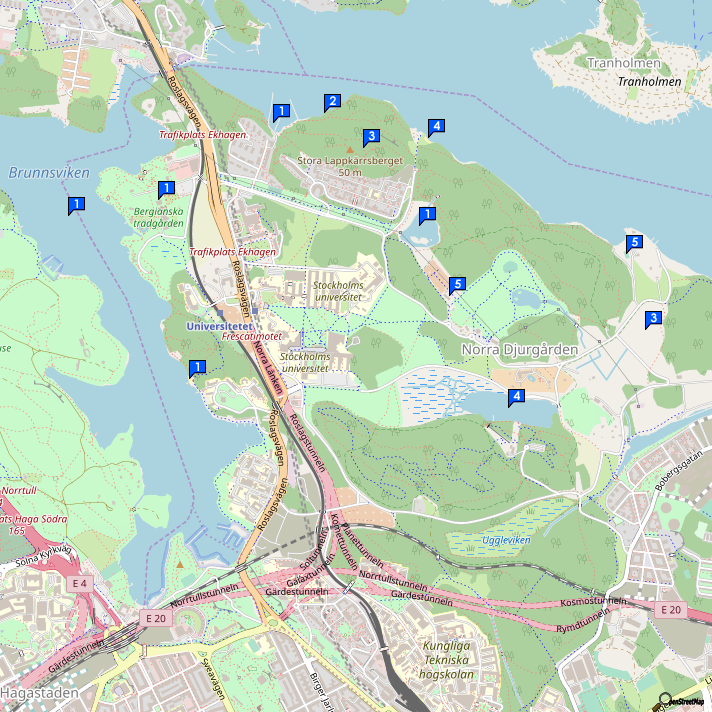

# Välkomna till Ekhagen!

Ni som är spekulanter på den här lägenheten vill säkert veta mer om Ekhagen och dess närområde. Vi har bott här länge och trivts mycket bra med naturen och närheten till innerstaden. 

## Historia

När isen drog sig tillbaka för ca tio tusen år sedan täcktes hela Norra Djurgården av hav. På stenåldern stack Stora Lappkärrsberget upp, och under vikingatiden hade strandlinjen förskjutits så att en gles skärgård bildats. Först under medeltiden var Norra Djurgården en sammanhängande ö. Här fanns då redan flera byar, och marken ägdes av olika klosterordnar som bedrev jordbruk. I slutet av 1600-talet gjorde Karl XI Djurgården till kunglig jaktpark. Ett två mil långt och drygt två meter högt staket skulle hålla viltet inne och vargarna ute. 

## Ekhagen

Ekhagen tillhör Norra Djurgården, och ligger i Ekoparken, världens första nationalstadspark. Ekhagen fick sitt namn från alla ekar på kullen. Området i funkisstil byggdes samtidigt som Gärdet på 1930-talet. Under 40 och 50-talet kryllade det av barn i området, och det fanns 4 livsmedelsaffärer, 2 konditorier, skomakeri, tobaksaffär, fiskaffär m.m. Allteftersom åren gick förändrades åldersstrukturen och på 80-talet bodde många pensionärer här. Det senaste decenniet har området föryngrats avsevärt i samband med att i stort sett alla fastigheter ombildats till bostadsrätter. 

## Förslag till promenader

Gå ut på fastighetens baksida. På våren möter ni ofta rådjur i den vitsippeklädda backen. Fortsätt ett stenkast till vänster och ni kommer ned till båthamnen som har goda möjligheter att ta emot nya medlemmar (1). Gå längs vattnet mot öster och ni kommer snart till klippor som lämpar sig utmärkt för kvällsbad och grillning (2). Viker ni av här och går upp i skogen kommer ni till Lappkärsbergets vikingagravar (3). Väljer ni att fortsätta längs med vattnet kommer ni till Kar de Mummas skrivarstuga och en sandstrand som lämpar sig för småbarn (4). Vandra vidare längs vattnet, och ni kommer in i skogen som kallas Stora Vargjakten. Här jagade Karl XI både varg och björn på 1600-talet. Idag är skogen perfekt för joggingturer och mountainbiking. Ta av mot höger när ni kommer till en tennisbana (5). Sommartid betar Kungens får på fältet, och här hittar ni även myskoxar och highland cattle (6). Vik av ned mot Laduviken som tidigare var en havsvik. Här kan ni höra näktergalen på kvällarna (7). Går ni till vänster kommer ni till fiskartorpet som är Djurgårdens äldsta byggnad och ursprungligen var Karl XI:s fiskarstuga (från 1680-talet). Fortsätter ni mot väster kommer ni till Stora Skuggan. Här finns en åretrunt-öppen servering och en 4H-gård med många djur som barnen och även nyfikna vuxna får klappa (8). Vandra vidare, och ni kommer till Lappkärret. Det skapades av misstag när studentbostäderna byggdes, och är nu en fin fågelsjö med några verkliga rariteter (9). Fortsätt längs vägen och ni är snart tillbaka i Ekhagen.

Om ni istället går västerut kommer ni till Bergianska trädgården (10). Där kan ni strosa bland fler än 9 000 växtarter från jordens alla hörn. Besök gärna Victoriahuset med dess jättenäckrosor eller Edvard Anderssons medelhavsväxthus. Bergianska trädgårdens historia går tillbaks till 1700-talet då dess föregångare låg i nuvarande Vasastaden. Den nya trädgården i Frescati grundades 1885. Om ni går ut mot trädgårdens nordvästra udde så kan ni hitta en klippa perfekt för sol och bad, dit nästan någon annan aldrig hittar (11). Om ni följer vattnet söderut kommer ni så småningom till en sandstrand (12). Lite längre bort kan ni hyra kanoter sommartid. På vintern plogas Brunnsviken så att man kan åka långfärdsskridskor (13). Om ni känner er hugade kan ni fortsätta längs vattnet runt hela Brunnsviken, förbi Haga, Tivoli och tillbaka till Ekhagen. Då har ni gått Hälsans stig, som är 12 km lång.

Vi hoppas ha givit er mersmak,

*Liselott & Alexis*

## Smultronställen i Ekhagen och på Norra Djurgården

1. Båthamnen
2. Klippor för kvällsbad eller grillning
3. Stora Lappkärrsberget med vikingagravar
4. Barnbad med sandstrand
5. Utomhustennisbana
6. Betesplats för kungens får
7. Laduviken med Djurgårdens äldsta byggnad
8. 4H-gården med många djur och året-runt-servering Skafferiet
9. Lappkärret med rikt fågelliv
10. Bergianska trädgården
11. "Hemlig" badplats
12. Badstrand
13. Brunnsviken med plogad skridskobana vintertid och kanotuthyrning sommartid

--

### Nykomlingar

1. Naturhistoriska Riksmuseet
2. Bockudden
1. Glassfabriken